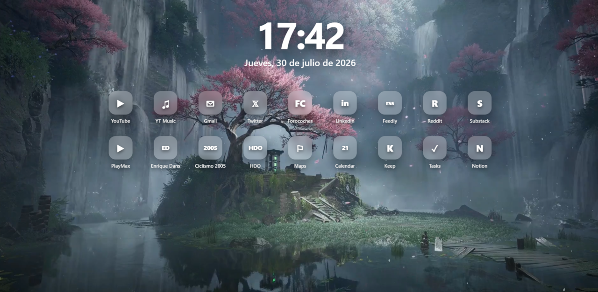

# Focus New Tab

A minimal custom new tab extension for Brave and Chromium-based browsers.

It replaces the default new tab page with a clean local dashboard that includes a video background, current time, full date and quick links to frequently used websites.

## Features

- Lightweight and simple
- Local video background
- Current time and full date
- Customizable quick links
- No dependencies
- No build step
- No analytics
- No unnecessary permissions
- Works locally

## Preview



## Folder structure

```text
focus-new-tab/
├── newtab.html
├── styles.css
├── newtab.js
├── assets/
│   └── fondo.mp4
├── docs/
│   └── preview.png
├── manifest.json
├── README.md
├── LICENSE
└── .gitignore
```

## Installation

### 1. Clone or download this repository

```bash
git clone https://github.com/enrelu/focus-new-tab.git
```

Or download the repository as a ZIP file from GitHub.

### 2. Add your video background

Place your own `.mp4` video inside the `assets` folder.

The file must be named:

```text
fondo.mp4
```

Final path:

```text
assets/fondo.mp4
```

### 3. Open the extensions page

In Brave, open:

```text
brave://extensions
```

In Chrome or other Chromium-based browsers, open:

```text
chrome://extensions
```

### 4. Enable Developer mode

Turn on **Developer mode**.

### 5. Load the extension

Click **Load unpacked** and select the project folder.

### 6. Open a new tab

Done.

## Customizing shortcuts

Edit the shortcuts inside `newtab.html`.

Example:

```html
<a class="shortcut" href="https://www.youtube.com/">
  <div class="icon"><span>▶</span></div>
  YouTube
</a>
```

Change the URL, icon text and label:

```html
<a class="shortcut" href="https://example.com/">
  <div class="icon"><span>E</span></div>
  Example
</a>
```

## Changing the background video

Replace this file:

```text
assets/fondo.mp4
```

with your own `.mp4` video.

If you want to use a different filename, update this line in `newtab.html`:

```html
<source src="assets/fondo.mp4" type="video/mp4">
```

## Customizing the style

Edit `styles.css`.

Useful sections:

| Section | Purpose |
|---|---|
| `.bg-video` | Controls the video background |
| `.date-block` | Controls the time and date section |
| `.shortcuts` | Controls the link grid |
| `.icon` | Controls shortcut icons |
| `.shortcut` | Controls shortcut labels |

## Permissions

This extension does not request any browser permissions.

It only uses the standard new tab override:

```json
{
  "chrome_url_overrides": {
    "newtab": "newtab.html"
  }
}
```

That means it only replaces the browser's new tab page.

It does **not** read:

- Browsing history
- Cookies
- Open tabs
- Files
- Personal data

## Browser support

Tested on:

- Brave
- Google Chrome

It should also work on other Chromium-based browsers, such as:

- Microsoft Edge
- Vivaldi
- Opera

## Development

There is no build step.

After editing files:

1. Open the extensions page.
2. Find the extension.
3. Click **Reload**.
4. Open a new tab.

## License

MIT License. See [LICENSE](LICENSE).
